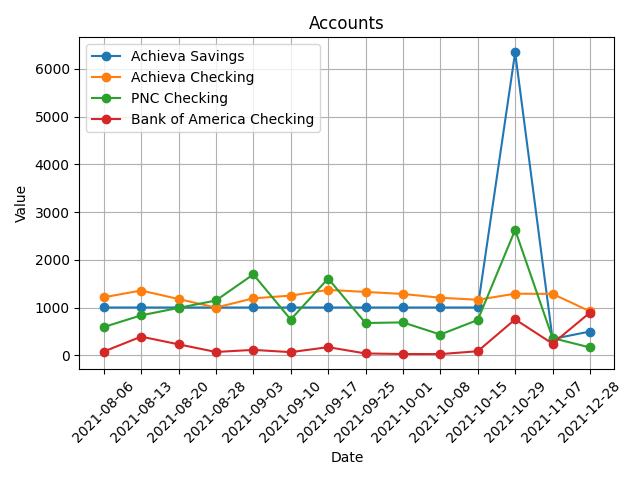
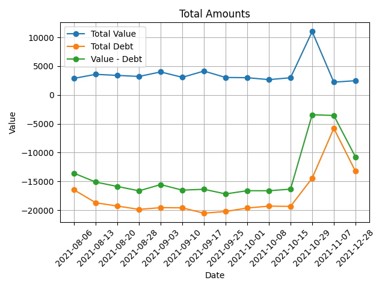

# Weekly Finance Report
This is an auto-generated report of our finances.
## Data Tables
* [Accounts](accounts.csv)
* [Debts](debts.csv)
* [Account Totals](total_accounts.csv)
* [Debt Totals](total_debts.csv)
* [Value Totals](total_value.csv)

## Value Report

The chart above shows the amount currently in our checking/savings accounts. Includes:
* Achieva Savings/Checking
* PNC Checking
* Bank of America Checking

This report does not include:
* Home/car values
* Ally Bank Savings Account
* Wealthfront Accounts
* 401K

## Debt Report

The chart above shows the amount of debt we're currently in. Includes:
* Achieva Credit Card (Black Card)
* PNC Credit Card (Blue Card)
* Capital One Credit Card

This report does not include:
* Mortgage
* Car/Boat Payments

## Totals Report

The chart above shows the amount of value in our accounts, compared to our debt

Notes:
- 10/29/2021: Sold truck; received $13,000 into accounts
- 11/07/2021: Transfered truck money into paying off credit card debt
